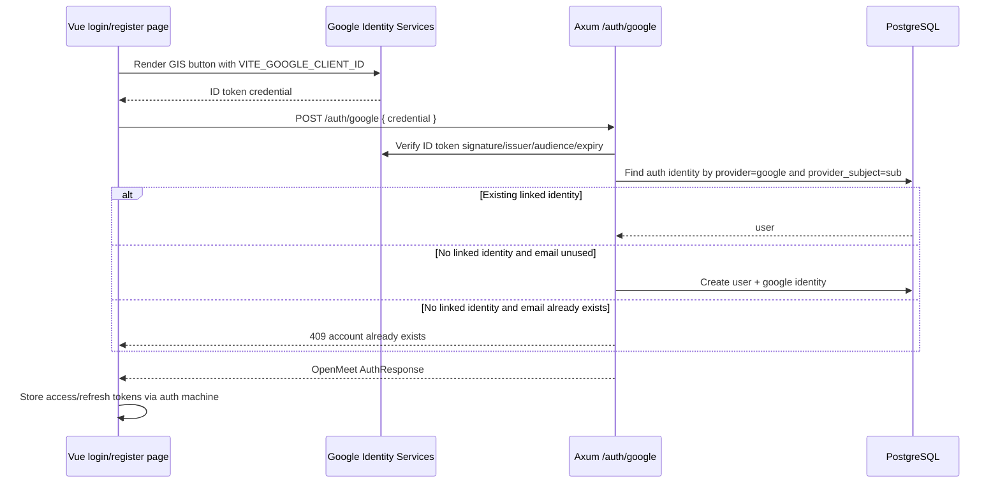

# feat: Add Google auth and clean refresh-token warnings

## Problem Frame

Deploy currently reports two Rust warnings:

- `RefreshToken` is never constructed in `openmeet-server/src/auth/models.rs`.
- `RtpPacketBuffer::get_many` is never used in `openmeet-server/src/sfu/packet_buffer.rs`.

The `RefreshToken` warning does **not** mean refresh tokens are absent. Refresh tokens are implemented today: login/register create opaque refresh tokens, hash them, store them in `refresh_tokens`, `/auth/refresh` validates the stored hash, and `/auth/logout` deletes the stored hash. The warning exists because the code selects refresh-token columns into a tuple instead of constructing the `RefreshToken` row struct.

The deeper auth work requested is adding Google authentication on login and sign-up while preserving OpenMeet's existing first-party access-token and refresh-token session model.

---

## Scope Boundaries

### In Scope

- Remove or resolve the dead-code warning for `RefreshToken` in a way that keeps refresh-token persistence explicit.
- Decide the fate of the unused RTP packet-buffer helper warning without changing media behavior.
- Add Google sign-in/sign-up using Google Identity Services for authentication only.
- Verify Google identity server-side before issuing OpenMeet tokens.
- Add database support for Google identities without keying users by mutable email addresses.
- Add Google buttons to login and register pages using existing UI patterns.
- Add required production/development env examples and deployment documentation.
- Add unit and integration coverage for the new auth paths and warning cleanup.

### Out of Scope

- Using Google tokens as OpenMeet session tokens.
- Requesting Google API scopes, storing Google access tokens, or storing Google refresh tokens.
- Full account-settings UI for linking/unlinking providers.
- Broad auth redesign, Firebase Auth adoption, or replacing the existing JWT/opaque refresh-token session model.
- Fixing all known auth security concerns in one pass, such as moving refresh tokens to `HttpOnly` cookies or complete CORS lockdown.

### Deferred to Follow-Up Work

- Refresh-token rotation and token-family replay detection.
- Server-set `HttpOnly; Secure; SameSite` refresh cookies.
- Account linking from an authenticated settings page.
- Workspace-domain restriction via Google `hd` claim.
- Scheduled expired refresh-token cleanup.

---

## Key Technical Decisions

1. Use Google Identity Services ID-token sign-in for login-only auth.
   - Rationale: OpenMeet only needs identity proof, not Google API access. GIS avoids deprecated `gapi.auth2` flows and avoids storing Google OAuth tokens.

2. Verify Google ID tokens on the server, then issue normal OpenMeet `AuthResponse` tokens.
   - Rationale: the client must not decide identity trust. Existing auth consumers already understand `AuthResponse { user, access_token, refresh_token }`.

3. Store Google identities by provider subject, not email.
   - Rationale: Google `sub` is the stable provider identifier. Email can change and should not be used as the provider primary key.

4. Do not silently link a Google account to an existing password account solely by matching email.
   - Rationale: matching email creates account-takeover risk. If a Google `sub` is not already linked and `users.email` already exists, return a clear conflict telling the user to sign in with password first. Explicit linking can be added later from an authenticated settings flow.

5. Allow Google-only users by making password credentials optional and adding provider identities.
   - Rationale: the current `password_hash NOT NULL` schema blocks clean Google-only sign-up. A separate identity table keeps provider auth semantics explicit.

6. Keep the current refresh-token behavior for this feature.
   - Rationale: refresh tokens are already persisted and revoked on logout. Rotation is important security work but not required to add Google auth safely within this scope.

---

## High-Level Technical Design

This illustrates the intended approach and is directional guidance for review, not implementation specification. The implementing agent should treat it as context, not code to reproduce.

---

## Implementation Units

### U1. Clarify And Clean Existing Warning Surfaces

**Goal:** Resolve the deploy warnings without hiding real missing behavior.

**Requirements:** Explain and clean `RefreshToken` usage; decide whether unused RTP batch retrieval is needed.

**Dependencies:** None.

**Files:**

- `openmeet-server/src/auth/models.rs`
- `openmeet-server/src/auth/handlers.rs`
- `openmeet-server/src/sfu/packet_buffer.rs`
- `openmeet-server/src/sfu/packet_buffer.rs` tests or existing module tests, if present

**Approach:**

- Update `/auth/refresh` to select `RefreshToken::as_select()` instead of selecting a tuple, then use the row fields. This keeps the model meaningful and removes the dead-code warning.
- For `RtpPacketBuffer::get_many`, either remove it if no NACK batching path uses it, or annotate/cover it only if it is intentionally reserved for upcoming packet retransmission work. Prefer removal unless research during implementation finds a concrete caller planned in the SFU code.
- Do not change refresh-token semantics in this unit.

**Patterns to follow:**

- `openmeet-server/src/auth/handlers.rs` uses Diesel `Selectable` structs for `User` queries.
- `openmeet-server/src/auth/models.rs` keeps row structs and insert structs near request/response DTOs.

**Test scenarios:**

- Refresh with a stored, unexpired refresh-token hash returns a new access token and constructs the row model path.
- Refresh with an expired token deletes the expired row and returns unauthorized.
- If `get_many` is retained, a packet-buffer unit test requests multiple known sequence numbers and returns only stored packets in request order.

**Verification:**

- `cargo check --release` no longer reports the `RefreshToken` warning.
- The RTP packet-buffer warning is either gone or explicitly justified by a test/annotation.

---

### U2. Add Database Support For Google Identities

**Goal:** Represent Google-linked users safely without treating email as provider identity.

**Requirements:** Support Google-only sign-up and future explicit provider linking while preserving existing password users.

**Dependencies:** U1 can be done independently.

**Files:**

- `openmeet-server/migrations/<timestamp>_add_auth_identities/up.sql`
- `openmeet-server/migrations/<timestamp>_add_auth_identities/down.sql`
- `openmeet-server/src/schema.rs`
- `openmeet-server/src/auth/models.rs`

**Approach:**

- Add an `auth_identities` table with `user_id`, `provider`, `provider_subject`, provider email metadata, and timestamps.
- Add a unique constraint on `(provider, provider_subject)`.
- Make `users.password_hash` nullable, or introduce a password-credential table if implementation reveals that nullable `password_hash` creates too much churn. The smaller brownfield change is nullable `password_hash` plus password-login code that only accepts users with a password hash.
- Preserve `users.email UNIQUE` for local account contact identity.
- Update Diesel schema and models to use `Option<String>` for `password_hash` if nullable.

**Patterns to follow:**

- Existing Diesel migrations in `openmeet-server/migrations/20251201000000_create_users/up.sql` and `openmeet-server/migrations/20251201000001_create_refresh_tokens/up.sql`.
- Existing row/insert DTO split in `openmeet-server/src/auth/models.rs`.

**Test scenarios:**

- Existing password user rows remain readable after the migration.
- A Google identity row cannot be inserted twice for the same provider and subject.
- Deleting a user cascades or otherwise removes the corresponding Google identity row.
- Password login ignores users whose `password_hash` is absent and returns a generic invalid-credentials response.

**Verification:**

- Server migrations apply cleanly from an empty database.
- Existing password registration/login still works after the schema change.

---

### U3. Add Server-Side Google ID Token Verification And Auth Endpoint

**Goal:** Add `POST /auth/google` that verifies Google identity and returns the existing OpenMeet auth response.

**Requirements:** Server-side Google verification, safe user lookup/creation, first-party OpenMeet token issuance.

**Dependencies:** U2.

**Files:**

- `openmeet-server/Cargo.toml`
- `openmeet-server/Cargo.lock`
- `openmeet-server/src/main.rs`
- `openmeet-server/src/auth/mod.rs`
- `openmeet-server/src/auth/routes.rs`
- `openmeet-server/src/auth/handlers.rs`
- `openmeet-server/src/auth/models.rs`
- `openmeet-server/src/auth/google.rs` or equivalent new module
- `openmeet-server/src/auth/*__tests*` or module-level tests if the project keeps tests inline

**Approach:**

- Add a Google verifier abstraction so handler tests can mock verification without calling Google.
- Prefer the `openidconnect` crate or a maintained Google ID-token verifier over manual JWT/JWKS validation.
- Validate issuer, audience/client ID, expiration, signature, and stable `sub`.
- Add server config for `GOOGLE_AUTH_ENABLED` and `GOOGLE_CLIENT_ID`; keep Google auth disabled or return a clear unavailable error if not configured.
- Implement `POST /auth/google` accepting a credential ID token.
- If `(provider='google', sub)` exists, load that user and issue tokens through the existing `create_tokens()` helper.
- If no provider identity exists and email is unused, create a user with optional password and insert the Google identity in a transaction.
- If no provider identity exists and email is already used, return `409 Conflict` with a generic account-exists message; do not auto-link.

**Patterns to follow:**

- Handler result style in `openmeet-server/src/auth/handlers.rs`.
- Existing token creation via `create_tokens()`.
- Environment loading style in `openmeet-server/src/main.rs`.

**Test scenarios:**

- Valid Google credential with new email creates a user, inserts a Google identity, and returns `AuthResponse`.
- Valid Google credential with existing provider subject signs in the linked user without creating duplicate rows.
- Valid Google credential with email matching an unlinked password account returns `409 Conflict` and does not create a provider link.
- Wrong audience is rejected.
- Wrong issuer is rejected.
- Expired credential is rejected.
- Missing Google configuration returns a controlled error and does not panic at request time, unless `GOOGLE_AUTH_ENABLED=true` is chosen to fail startup.
- Database failure during user/identity creation does not create a partial account.

**Verification:**

- Password auth endpoints still return the same response shapes.
- Google auth returns the same `AuthResponse` shape as password login/register.
- Server tests cover success and takeover-risk failure paths without relying on live Google network calls.

---

### U4. Add Client Auth API And XState Support For Google Login

**Goal:** Make Google auth a first-class client auth flow while reusing existing token storage/navigation behavior.

**Requirements:** Frontend sends Google credentials to the backend, stores OpenMeet tokens, and handles errors like password auth.

**Dependencies:** U3 server contract.

**Files:**

- `openmeet-client/src/services/auth-api.ts`
- `openmeet-client/src/xstate/machines/auth/types.ts`
- `openmeet-client/src/xstate/machines/auth/index.ts`
- `openmeet-client/src/composables/useAuth.ts`
- `openmeet-client/src/xstate/machines/auth/__tests__/auth.machine.test.ts`
- `openmeet-client/src/services/__tests__/auth-api.test.ts` if service tests are introduced

**Approach:**

- Add an API method that posts `{ credential }` to `/auth/google` and returns `AuthResponse`.
- Add `AuthEventType.GOOGLE_LOGIN` with a credential payload.
- Add a Google auth actor and state, or reuse the existing authenticating/registration failure states if the event can map cleanly to the same UX.
- Reuse `setAuthFromResponse`, `saveTokensToStorage`, and `navigateToDashboard` after successful Google auth.
- Add composable computed state such as `isGoogleAuthenticating` only if the UI needs a separate disabled/loading state.

**Patterns to follow:**

- `loginActor` / `registerActor` in `openmeet-client/src/xstate/machines/auth/index.ts`.
- Centralized `handleResponse<T>()` in `openmeet-client/src/services/auth-api.ts`.

**Test scenarios:**

- `GOOGLE_LOGIN` from unauthenticated state calls the Google auth actor and transitions to authenticated on success.
- Successful Google auth stores access and refresh tokens exactly like password login.
- Successful Google auth navigates to `/dashboard`.
- Failed Google auth sets a user-readable error and allows retry.
- Existing password login/register/refresh/logout tests continue to pass.

**Verification:**

- Client unit tests prove Google auth uses the same OpenMeet session model as password auth.
- No component directly writes auth cookies outside the auth machine actions.

---

### U5. Add Google Buttons To Login And Register Pages

**Goal:** Expose Google sign-in/sign-up in the existing auth pages without redesigning the flows.

**Requirements:** Login and sign-up pages include a working Google button that sends credentials into the auth machine.

**Dependencies:** U4.

**Files:**

- `openmeet-client/src/components/auth/GoogleAuthButton.vue` or a similarly scoped component
- `openmeet-client/src/pages/LoginPage.vue`
- `openmeet-client/src/pages/RegisterPage.vue`
- `openmeet-client/src/components/auth/__tests__/GoogleAuthButton.test.ts` or page-level tests if component tests are not established

**Approach:**

- Load Google Identity Services from `https://accounts.google.com/gsi/client` only when `VITE_GOOGLE_CLIENT_ID` is configured.
- Render a Google button in a small component shared by login and register pages.
- On GIS credential callback, dispatch `GOOGLE_LOGIN` to the auth actor.
- Keep password form behavior unchanged.
- Display Google auth errors using the existing destructive alert style.
- Disable or hide the Google button when Google env is absent rather than rendering a broken control.

**Patterns to follow:**

- Existing login/register page use of `Button`, `Card`, `Spinner`, and `AlertCircle`.
- Existing `<script setup lang="ts">` component style.

**Test scenarios:**

- With `VITE_GOOGLE_CLIENT_ID` set, login page renders the Google button and initializes GIS once.
- Register page renders the same Google button with sign-up copy.
- GIS credential callback dispatches `GOOGLE_LOGIN` with the credential.
- Missing client ID hides or disables the button with no runtime exception.
- Password form submit still dispatches `LOGIN` / `REGISTER` as before.

**Verification:**

- Login and register pages keep their existing layout and password flows.
- Google button is visible and usable only when configured.

---

### U6. Update Env Templates, Deployment Docs, And GitHub/VPS Expectations

**Goal:** Make Google auth deployable without guessing production settings.

**Requirements:** Document all new env vars and ensure production setup is clear.

**Dependencies:** U3 and U5 define exact env names.

**Files:**

- `.env.example`
- `openmeet-client/.env.example`
- `openmeet-server/.env.example`
- `README.md`
- `docs/PRODUCTION_DEPLOYMENT.md`
- `docker-compose.yaml` only if new root-level values must be forwarded explicitly
- `.github/workflows/*.yml` only if CI/deploy needs validation of new non-secret config

**Approach:**

- Add client env such as `VITE_GOOGLE_CLIENT_ID` and an optional display/enable flag if needed.
- Add server env such as `GOOGLE_AUTH_ENABLED=true` and `GOOGLE_CLIENT_ID=<google-web-client-id>`.
- Keep any Google client secret out of the frontend. If the implementation remains GIS ID-token handoff, no client secret is needed.
- Document Google Cloud Console setup: OAuth consent screen, Web application client, authorized JavaScript origins, and production/dev origins.
- Document that frontend env is build-time and requires rebuilding the frontend image.

**Patterns to follow:**

- Existing production env documentation in `docs/PRODUCTION_DEPLOYMENT.md`.
- Existing `.env.example` placeholder style with no real secrets.

**Test scenarios:**

- Test expectation: none for documentation-only changes, but implementation should verify the app starts with Google auth disabled and enabled in a configured environment.

**Verification:**

- A deployer can configure Google auth from docs without needing source-code inspection.
- No real client IDs or secrets are committed.

---

### U7. Add End-To-End And Regression Verification

**Goal:** Prove password auth still works and Google auth works through the intended user-visible flows.

**Requirements:** Cover server behavior, client state machine, and visible login/register pages.

**Dependencies:** U1-U6.

**Files:**

- `openmeet-server/src/auth/*` tests or integration test files chosen during implementation
- `openmeet-client/src/xstate/machines/auth/__tests__/auth.machine.test.ts`
- `openmeet-client/src/components/auth/__tests__/GoogleAuthButton.test.ts` or page tests
- `openmeet-client/e2e/*auth*.spec.ts` if a test-only fake Google provider path is added

**Approach:**

- Mock Google token verification in server tests; do not depend on live Google credentials in CI.
- Keep browser E2E optional unless a deterministic fake credential path is added for test builds.
- Include regression checks for password login/register because nullable password hashes and provider identities touch core auth.

**Test scenarios:**

- Existing password register creates a password user and stores refresh-token hash.
- Existing password login rejects a Google-only user with generic invalid credentials.
- Google sign-up creates a Google-only user and returns OpenMeet tokens.
- Google login for an existing linked user returns OpenMeet tokens.
- Google login with matching email but no link returns `409 Conflict` and does not link accounts.
- Client Google auth success stores tokens and routes to dashboard.
- Client Google auth failure displays the existing auth error UI.
- Logout after Google login deletes the OpenMeet refresh token.

**Verification:**

- Server `cargo test` passes without auth warnings.
- Client auth machine and component tests pass.
- Manual production verification confirms Google button appears on `https://openmeets.eu/login` and `https://openmeets.eu/register`, signs in, and returns the user to the dashboard.

---

## System-Wide Impact

- **End users:** gain Google sign-in/sign-up while password login/register remains available.
- **Security:** Google identity is verified server-side and mapped by provider `sub`; same-email account takeover is explicitly blocked.
- **Database:** users and auth identity schema change; password hashes become optional or move into a separate credentials table.
- **Operations:** production requires Google Cloud Console configuration and new env variables.
- **CI/deploy:** warnings should be reduced, and tests should avoid live Google dependencies.

---

## Risks And Mitigations

- **Risk:** Matching-email Google login could take over a password account.
  - **Mitigation:** never auto-link from unauthenticated Google login; require a future authenticated linking flow.

- **Risk:** Google verification code accidentally trusts unverified JWT claims.
  - **Mitigation:** use a maintained OIDC verifier and test wrong audience, issuer, expiry, and signature cases.

- **Risk:** Nullable password hash breaks password login.
  - **Mitigation:** update login to handle absent hashes as invalid credentials and add regression tests.

- **Risk:** Production deploy has client ID mismatch between frontend and backend.
  - **Mitigation:** document exact Google Console origins/client ID requirements and validate env at startup when Google auth is enabled.

- **Risk:** Google script loading makes tests flaky.
  - **Mitigation:** isolate GIS loading in a component/service with mockable boundaries.

---

## Assumptions

- Google auth is for authentication only; OpenMeet does not need Google Calendar, Drive, or other Google API access.
- Google-only users are allowed.
- Existing password accounts should not be auto-linked to Google by email alone.
- Current JavaScript-readable token storage remains in place for this feature to keep scope bounded.
- Production Google auth uses the same top-level app domain and API/SFU domain documented in `docs/PRODUCTION_DEPLOYMENT.md`.

---

## Open Questions For Implementation

- Should Google auth be disabled by default unless `GOOGLE_AUTH_ENABLED=true`, or enabled whenever `GOOGLE_CLIENT_ID` is present?
- Should the UI copy say `Continue with Google`, `Sign in with Google`, or vary between login and register pages?
- Should a Google-created user name be updated from Google on every login or only at first account creation?
- Should the future account-linking flow live on a settings page or inside login conflict recovery?

---

## References

- Existing auth handlers: `openmeet-server/src/auth/handlers.rs`
- Existing auth models: `openmeet-server/src/auth/models.rs`
- Existing auth routes: `openmeet-server/src/auth/routes.rs`
- Existing auth API client: `openmeet-client/src/services/auth-api.ts`
- Existing auth machine: `openmeet-client/src/xstate/machines/auth/index.ts`
- Existing login page: `openmeet-client/src/pages/LoginPage.vue`
- Existing register page: `openmeet-client/src/pages/RegisterPage.vue`
- Production deployment docs: `docs/PRODUCTION_DEPLOYMENT.md`
- Google Identity Services overview: `https://developers.google.com/identity/gsi/web/guides/overview`
- Google ID-token verification: `https://developers.google.com/identity/gsi/web/guides/verify-google-id-token`
- Rust `openidconnect` crate: `https://docs.rs/openidconnect/latest/openidconnect/`
