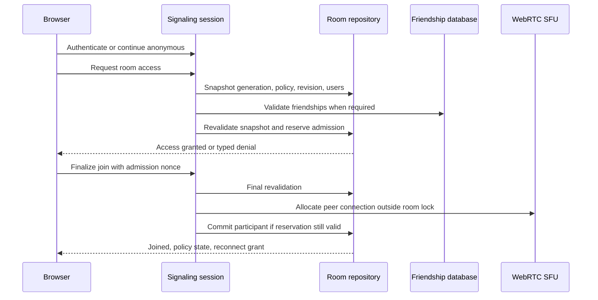
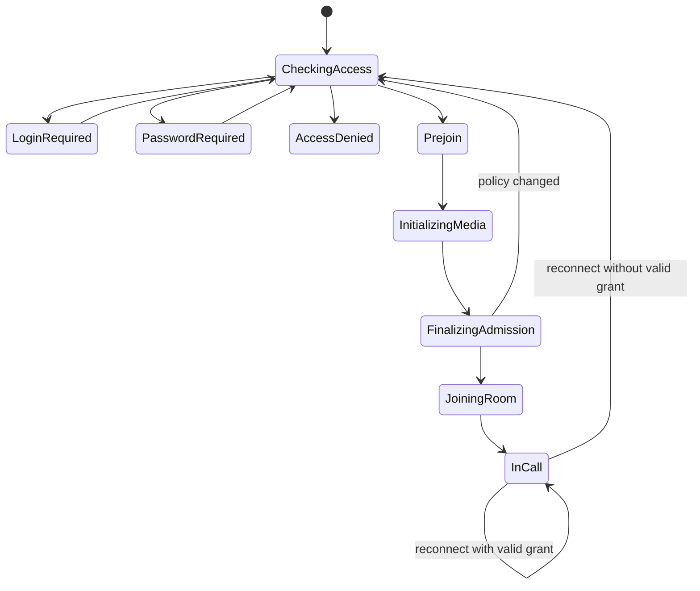
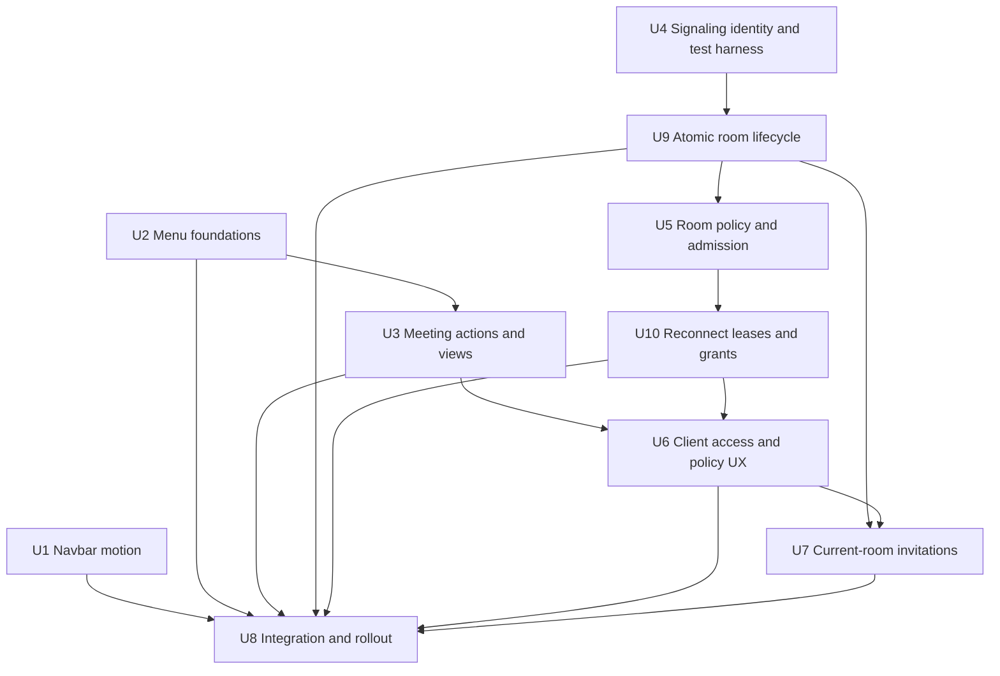
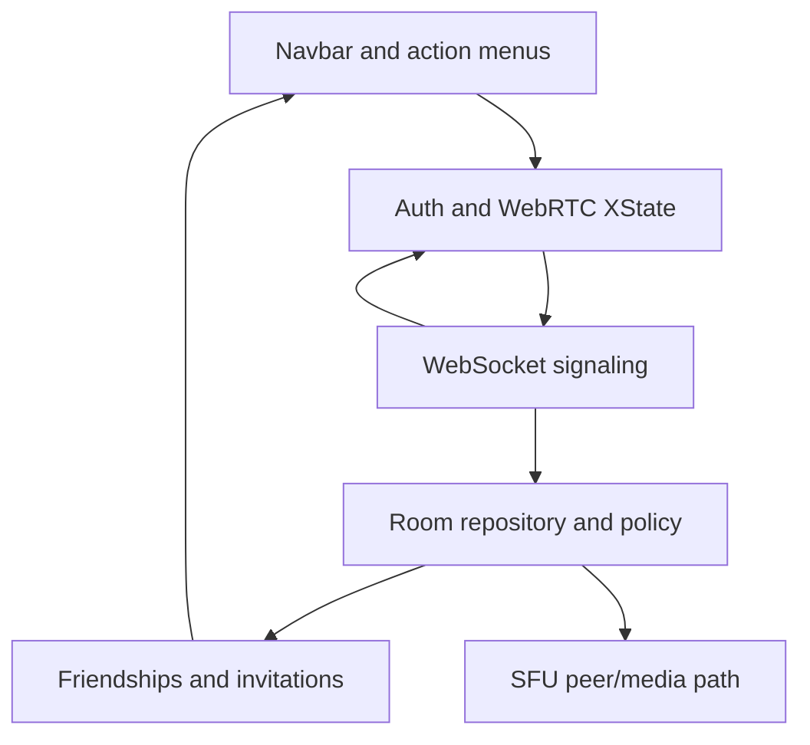

# feat: Add action menus and secure meeting admission

## Summary

Introduce measured Motion layout for intrinsic navbar width, shared shadcn dropdown/context-menu surfaces, dynamic dashboard/meeting actions, and versioned server-side room admission before WebRTC allocation. Security remains ephemeral with room while identity, password, friendship, reconnect, and invitation checks are enforced by server.

---

## Problem Frame

Frequent dashboard and meeting actions lack one consistent mouse/keyboard/touch surface. Current signaling trusts room ID possession, has no authenticated socket identity, and allocates meeting resources before any access policy can be enforced (see origin: `docs/brainstorms/2026-08-09-meeting-action-menus-room-security-requirements.md`).

---

## Requirements

- R1. Navbar smoothly animates horizontal size whenever content width changes.
- R2. Dashboard and meeting menus use shadcn-style primitives, icons for every option, and both ellipsis and context triggers.
- R3. Menus remain keyboard accessible, touch usable, and Harbor styled.
- R4. Dashboard menu provides green New meeting and red Report a bug opening GitHub in a new tab.
- R5. Dashboard menu lists friends with left-side presence and call actions.
- R6. Meeting menu dynamically opens/closes chat.
- R7. Authenticated meeting participants can invite friends into current room.
- R8. Meeting provides Grid and automatic Speaker view with pinning.
- R9. Audio and Video menu actions mirror and toggle live state.
- R10. Meeting menu provides Disconnect and privacy-safe red GitHub bug reporting.
- R11. Room policy supports Open, Password, and Friends-only with visible current status.
- R12. Any authenticated admitted participant may change policy; all connected participants see toast/status update.
- R13. Password policy gates future joins server-side and retains current participants.
- R14. Friends-only gates future joins against every distinct authenticated current participant and retains existing guests.
- R15. Anonymous Friends-only visitor logs in/registers, returns safely to room, and is rechecked.
- R16. Direct signaling cannot bypass server-side access restrictions.
- R17. Policy/password live only for in-memory room generation.
- R18. Passwords, hashes, JWTs, reconnect grants, admission nonces, and invitation credentials never enter logs, broadcasts, bug reports, URLs, or persistent client state. High-entropy room ID remains permitted only in canonical `/room/:id` route and is excluded from diagnostic/report URLs.
- R19. Friends-only auto-opens after explicit last-authenticated departure or reconnect grace expiry.
- R20. Duplicate active connections for same authenticated account are rejected.
- R21. One-use, room-bound reconnect grant preserves transport recovery for 60 seconds.
- R22. Invitation to ended room generation shows Meeting ended and cannot recreate room.

**Origin actors:** A1 authenticated participant, A2 anonymous participant, A3 friend/invitee, A4 meeting server.

**Origin flows:** F1 Dashboard action menu, F2 Meeting action menu, F3 Change room security, F4 Join restricted room.

**Origin acceptance examples:** AE1-AE12 in origin document.

---

## Scope Boundaries

- Do not persist room policy or password after in-memory room generation ends.
- Do not add permanent host/owner, waiting room, manual admission, or per-user approval.
- Do not disconnect existing participants when policy tightens.
- Do not add layouts beyond Grid and Speaker.
- Do not replace existing primary controls; menus mirror canonical actions.
- Do not store bug reports in OpenMeet.
- Do not expose context-menu interception over inputs, links, selected text, chat, or media controls.

### Deferred to Follow-Up Work

- Persistent room ownership and scheduled meetings.
- General account/session redesign beyond signaling identity and safe room return.
- Broader CORS overhaul unrelated to exact WebSocket Origin allowlist required here.

---

## Context & Research

### Relevant Code and Patterns

- `openmeet-client/src/components/layout/TheNavbar.vue`: existing responsive staged motion and current non-interpolable desktop `w-fit` behavior.
- `openmeet-client/src/components/ui/dropdown-menu/`: local shadcn/Reka wrapper pattern to mirror for context menus.
- `openmeet-client/src/pages/DashboardPage.vue`: canonical friend list, online status, meeting creation, and friend call handlers.
- `openmeet-client/src/components/meeting-page/MeetingControls.vue`: existing shadcn dropdown and canonical chat/media/disconnect controls.
- `openmeet-client/src/components/meeting-page/VideoGrid.vue`: current focused layout to replace with explicit Grid/Speaker/pin state.
- `openmeet-client/src/xstate/machines/webrtc/`: canonical meeting lifecycle and typed signaling event ownership.
- `openmeet-server/src/signaling/handler.rs`: join orchestration and current room-lock/WebRTC coupling.
- `openmeet-server/src/sfu/room.rs`: correct home for ephemeral policy, revision, generation, participants, and broadcasts.
- `openmeet-server/src/social/handlers.rs`: accepted friendship, presence, throttled call invitation, and meeting-history patterns.

### Institutional Learnings

- Snapshot room state under narrow lock, release before database/password/WebRTC work, then revalidate revision/generation before mutation.
- Update Rust signaling variants, TypeScript message union, XState events, and cleanup together.
- Preserve two-participant A/V baseline with isolated browser contexts.
- Current social implementation postdates `.planning/codebase/`; live code governs where documentation drifts.

### External References

- [OWASP WebSocket Security](https://cheatsheetseries.owasp.org/cheatsheets/WebSocket_Security_Cheat_Sheet.html)
- [OWASP Password Storage](https://cheatsheetseries.owasp.org/cheatsheets/Password_Storage_Cheat_Sheet.html)
- [JWT Best Current Practices](https://www.rfc-editor.org/rfc/rfc8725.html)
- [Axum 0.8 WebSocketUpgrade](https://docs.rs/axum/0.8.8/axum/extract/ws/struct.WebSocketUpgrade.html)
- [Motion Vue layout animations](https://motion.dev/docs/vue-layout-animations)
- [Reka Context Menu](https://reka-ui.com/docs/components/context-menu)
- [WebRTC Stats](https://www.w3.org/TR/webrtc-stats/)

---

## Key Technical Decisions

| Decision | Chosen approach | Rationale |
|---|---|---|
| Navbar width | Motion `layoutRoot` on fixed nav and `layout` capsule/content | Animates intrinsic content width; CSS cannot interpolate `fit-content` reliably. |
| Menu parity | Shared typed action descriptors rendered by separate dropdown/context primitives | Business logic stays single-source while each Reka family keeps correct focus contract. |
| Signaling identity | First-message optional authentication using access JWT, never URL | Browser cannot set Authorization header; invalid supplied credential must fail, not downgrade. |
| Admission | Versioned snapshot-check-revalidate with pending admission nonce | Prevents stale policy/friend result and avoids DB/Argon2/WebRTC under room lock. |
| Password | Argon2id PHC hash in room, bounded `spawn_blocking`, attempt limits | Ephemeral secure verification without plaintext persistence or CPU exhaustion. |
| Reconnect | Detached-participant lease plus one-use hashed grant bound to room generation/participant, 60-second expiry | Keeps room/grant alive for sole-participant recovery without reusable policy bypass. |
| Speaker detection | Participant-mapped WebRTC audio stats with hysteresis and Web Audio fallback | Avoids rapid switching and handles incomplete `audioLevel` support. |
| Invitations | Distinct current-room invitation path carrying opaque invitation reference bound to room generation | Existing call path creates/reuses another room and room ID alone cannot distinguish recreation. |
| Friendship timing | Friendship must be accepted when authorization is evaluated; unchanged room policy/member snapshot linearizes reservation | Immediate unfriend does not eject or retroactively invalidate reserved admission. |
| Rollout | Protocol version plus disabled-by-default enforcement gate; deploy server support, then client, then enable strict admission | Legacy Join compatibility must never bypass an enabled restricted room. |

Raise `jsonwebtoken` manifest minimum to at least `10.3.0` because older compatible resolutions are affected by CVE-2026-25537; current lock already resolves `10.4.0`. Pin algorithm/claims and reuse decoding key.

---

## Open Questions

### Resolved During Planning

- Empty authenticated set in Friends-only: atomically return policy to Open and notify remaining guests.
- Same account joining twice: reject duplicate active participant; reconnect grant is separate recovery path.
- Reconnect policy: one-use, rotated room-bound grant expiring after 60 seconds.
- Ended current-room invitation: expire and show Meeting ended; never recreate room.
- Context trigger surface: dashboard background/header and meeting video canvas only, excluding interactive descendants.
- Password bounds: 8-128 UTF-8 bytes, exact bytes preserved; setting Password requires confirmation, joining requires one field.
- Logout during call: disconnect meeting before completing logout; do not demote live identity to guest.
- Friendship mutation timing: accepted at authorization evaluation; later unfriend does not eject participant or cancel committed reservation.
- Protocol deployment: additive server support ships disabled, compatible client ships next, strict admission then enables; rollback disables policy creation before older client use.

### Deferred to Implementation

- Exact active-speaker threshold/poll/hold constants: tune against fake-media and browser observations while preserving documented hysteresis behavior.
- Exact helper/component names: follow local conventions and keep shared abstractions minimal.

---

## High-Level Technical Design

> *This illustrates the intended approach and is directional guidance for review, not implementation specification. The implementing agent should treat it as context, not code to reproduce.*

| Policy | Identity required | Join proof | Existing participants |
|---|---|---|---|
| Open | No | None | Stay connected |
| Password | No | Correct password or valid reconnect grant | Stay connected |
| Friends-only | Yes | Accepted friendship with every distinct authenticated current user, or valid reconnect grant | Stay connected; auto-open after explicit last-authenticated departure or reconnect grace expiry |

Client access lifecycle:

---

## Implementation Units

### U1. Animate Intrinsic Navbar Width

**Goal:** Smoothly animate desktop navbar width whenever route/auth/localized content changes while preserving staged mobile/tablet expansion.

**Requirements:** R1; origin AE1.

**Dependencies:** None.

**Files:**
- Modify: `openmeet-client/src/components/layout/TheNavbar.vue`
- Modify: `openmeet-client/src/assets/index.css`
- Test: `openmeet-client/src/components/layout/__tests__/TheNavbar.test.ts`

**Approach:**
- Use Motion layout animation for fixed desktop root/capsule and let rendered content define target width.
- Remove competing desktop CSS width transition; retain explicit sequential mobile/tablet width then height phases.
- Keep dropdown portals outside width measurement and honor reduced-motion preference.

**Patterns to follow:**
- Existing `motion-v` use in `openmeet-client/src/pages/LandingPage.vue`.
- Existing responsive/timer cleanup in `TheNavbar.vue`.

**Test scenarios:**
- Covers AE1. Login/logout and marketing/non-marketing route changes animate between measured widths without instant jump.
- Long user name/localized labels settle without clipping or viewport overflow.
- Reduced motion changes width without transform animation.
- Mobile/tablet staged width-height sequence remains unchanged.

**Verification:**
- Navbar width transitions smoothly in browser across route/auth state and remains content-sized after animation.

### U2. Add Shared Menu Foundations and Dashboard Actions

**Goal:** Provide shadcn dropdown/context parity, toast foundation, safe bug-report URLs, and dashboard action menu.

**Requirements:** R2-R5; origin F1, AE2.

**Dependencies:** None.

**Files:**
- Create: `openmeet-client/src/components/ui/context-menu/`
- Create: `openmeet-client/src/components/ui/toast/`
- Create: `openmeet-client/src/components/dashboard-page/DashboardActionMenu.vue`
- Create: `openmeet-client/src/lib/github-issue.ts`
- Modify: `openmeet-client/src/App.vue`
- Modify: `openmeet-client/src/pages/DashboardPage.vue`
- Modify: `openmeet-client/src/locales/en.json`
- Test: `openmeet-client/src/components/dashboard-page/__tests__/DashboardActionMenu.test.ts`
- Test: `openmeet-client/src/lib/__tests__/github-issue.test.ts`
- Create/Test: `openmeet-client/e2e/action-menus.spec.ts`

**Approach:**
- Mirror local shadcn wrapper style with Reka ContextMenu primitives; do not cross-mount dropdown items inside context root.
- Share action descriptors/dispatchers between visible ellipsis and designated context surface.
- Reuse Dashboard canonical create/call handlers and friend data; preserve standalone controls.
- Build bug URL from positive whitelist only and render as external anchor where possible.
- Give every action an icon, style New meeting with Harbor green, style Report a bug with coral/red, and always open report in a new tab.

**Test scenarios:**
- Ellipsis, keyboard context key, right-click, and long-press expose equivalent actions.
- Native context menu remains available on input/link/selected text.
- Friends show left online/offline status and disabled/loading call state; empty/error social state leaves New meeting and Report bug usable.
- Every option has an accessible icon; New meeting is green; Report a bug is red and opens a new tab.
- Bug URL contains bounded browser/app context but excludes room ID, user names, tokens, logs, chat, SDP, ICE, TURN, and password.

**Verification:**
- Dashboard actions work through both menu triggers with 44px touch targets and Harbor styling.

### U3. Add Meeting Actions, Speaker View, and Pinning

**Goal:** Add meeting menu and make Grid/Speaker, active speaker, pin, chat, and media actions canonical and dynamic.

**Requirements:** R2, R3, R6-R10; origin F2, AE4, AE5.

**Dependencies:** U2.

**Files:**
- Create: `openmeet-client/src/components/meeting-page/MeetingActionMenu.vue`
- Create: `openmeet-client/src/composables/useActiveSpeaker.ts`
- Modify: `openmeet-client/src/pages/MeetingPage.vue`
- Modify: `openmeet-client/src/components/meeting-page/MeetingControls.vue`
- Modify: `openmeet-client/src/components/meeting-page/VideoGrid.vue`
- Modify: `openmeet-client/src/components/meeting-page/ParticipantTile.vue`
- Modify: `openmeet-client/src/services/webrtc-sfu.ts`
- Modify: `openmeet-client/src/locales/en.json`
- Test: `openmeet-client/src/components/meeting-page/__tests__/MeetingActionMenu.test.ts`
- Test: `openmeet-client/src/composables/__tests__/useActiveSpeaker.test.ts`
- Modify/Test: `openmeet-client/e2e/action-menus.spec.ts`

**Approach:**
- Lift explicit view mode and pin to meeting owner; Grid tile click does not create hidden third layout, Speaker tile click pins/unpins.
- Poll participant-mapped inbound audio stats with attack/release hysteresis; use one AudioContext/analyser fallback when stats fields unavailable.
- Derive media labels from live tracks/canonical meeting state and dispatch same actions as bottom controls.
- Scope context trigger to video canvas; menu excludes interactive descendants.

**Test scenarios:**
- Chat/media labels and icons update after menu and bottom-control actions; missing/ended tracks yield recovery state rather than false enabled label.
- Active speaker requires sustained signal, does not flap, and falls back predictably during silence.
- Pin overrides active speaker; unpin resumes automatic mode; participant departure clears pin.
- Grid remains equal layout and ignores pin until Speaker selected.
- Disconnect cleans media/signaling; report action is red and privacy-safe.

**Verification:**
- Menu and existing controls remain behaviorally synchronized on desktop/touch.

### U4. Add Server Test Harness and Bind Signaling Identity

**Goal:** Establish runnable server integration tests and trustworthy optional connection identity before policy enforcement.

**Requirements:** R16, R18; origin A4, F4.

**Dependencies:** None.

**Files:**
- Modify: `openmeet-server/Cargo.toml`
- Modify: `openmeet-server/Cargo.lock`
- Modify: `openmeet-server/src/main.rs`
- Create: `openmeet-server/src/lib.rs`
- Modify: `openmeet-server/src/auth/jwt.rs`
- Modify: `openmeet-server/src/signaling/message.rs`
- Modify: `openmeet-server/src/signaling/handler.rs`
- Modify: `openmeet-server/src/sfu/participant.rs`
- Test: `openmeet-server/src/signaling/message.rs`
- Create/Test: `openmeet-server/tests/room_access_websocket.rs`
- Modify: `.github/workflows/test.yml`

**Approach:**
- Extract reusable router/application-state construction so integration tests can bind random listeners with migrated PostgreSQL fixtures.
- Raise jsonwebtoken manifest floor to patched 10.x and validate algorithm, expiry, subject, issuer/audience where configured.
- Require first signaling action to authenticate supplied access JWT or explicitly continue anonymous; invalid supplied credential closes/rejects and never downgrades.
- Bind server-derived optional user ID/display name to session/participant; ignore client identity claims.
- Add protocol version and disabled-by-default enforcement gate for coordinated rollout.
- Add exact WebSocket Origin allowlist, bounded connection/message rates, bounded outbound queues, and frame/message sizes as required defenses for credential-bearing WebSocket session.

**Execution note:** Start with failing handshake/direct-join integration tests and make test harness runnable before policy units.

**Test scenarios:**
- Valid JWT binds identity; absent credential stays anonymous; expired/malformed credential rejects without guest downgrade.
- Direct Join before identity decision rejects before peer allocation.
- Wrong/missing/null Origin in strict production mode, oversized frame, connection/auth/access flood, and outbound backpressure reject safely; logs contain no credential.
- Enforcement disabled supports legacy Open join but cannot create restricted policies; enforcement enabled rejects legacy Join.

**Verification:**
- Integration harness runs against isolated server/database and signaling identity is server-owned before room messages.

### U9. Make Room Generation and WebRTC Join Lifecycle Atomic

**Goal:** Eliminate room create/delete races and move expensive WebRTC work outside room locks before admission policy is layered in.

**Requirements:** R16, R17, R20; origin A4, F4, AE9.

**Dependencies:** U4.

**Files:**
- Modify: `openmeet-server/src/signaling/handler.rs`
- Modify: `openmeet-server/src/sfu/room.rs`
- Modify: `openmeet-server/src/sfu/repository.rs`
- Test: `openmeet-server/src/sfu/repository.rs`
- Modify/Test: `openmeet-server/tests/room_access_websocket.rs`

**Approach:**
- Replace room-exists/create split with atomic get-or-create returning immutable generation ID.
- Delete only when same generation/instance remains empty; never delete by textual room ID alone.
- Separate participant reservation, peer construction, and final participant commit so asynchronous WebRTC work occurs without room write lock.
- Clean reservations on socket close, media failure, peer failure, timeout, and explicit cancellation.

**Execution note:** Add concurrency characterization tests before moving current join lock boundaries.

**Test scenarios:**
- Concurrent first joins share one room generation.
- Empty-room deletion racing new join cannot remove new/non-empty generation.
- WebRTC setup failure removes reservation and room when appropriate.
- Reservation finalization against replaced/deleted generation fails and closes orphan peer.
- Existing two-participant media remains bidirectional after lock refactor.

**Verification:**
- Repository lifecycle is generation-safe and no DB/Argon2/WebRTC await occurs under long-lived room lock.

### U5. Enforce Ephemeral Room Policy and Race-Safe Admission

**Goal:** Implement Open/Password/Friends-only policies, policy updates, and race-safe admission reservations.

**Requirements:** R11-R20; origin F3, F4, AE6-AE10.

**Dependencies:** U4, U9.

**Files:**
- Create: `openmeet-server/src/sfu/access.rs`
- Create: `openmeet-server/src/social/friendships.rs`
- Modify: `openmeet-server/src/sfu/mod.rs`
- Modify: `openmeet-server/src/sfu/room.rs`
- Modify: `openmeet-server/src/sfu/participant.rs`
- Modify: `openmeet-server/src/signaling/message.rs`
- Modify: `openmeet-server/src/signaling/handler.rs`
- Modify: `openmeet-server/src/social/mod.rs`
- Modify: `openmeet-server/src/social/handlers.rs`
- Test: `openmeet-server/src/sfu/access.rs`
- Test: `openmeet-server/src/sfu/room.rs`
- Test: `openmeet-server/tests/room_access_websocket.rs`
- Test: `openmeet-server/tests/friends_only_access.rs`

**Approach:**
- Store private policy verifier, public mode, monotonic revision, room generation, and pending admissions in Room.
- Hash/verify 8-128 byte password with Argon2id through semaphore-bounded blocking work outside lock; enforce global plus per-IP/room/account access and policy-update limits before expensive work.
- Snapshot generation/policy/revision/distinct authenticated user IDs, perform checks outside lock, then bounded revalidate/retry and reserve CSPRNG admission nonce.
- Bind admission nonce to socket/session, identity, generation, policy revision, and short expiry; consume once and cap globally/per room. Clean on disconnect/cancel/failure/timeout.
- Friends DB failures fail closed; accepted friendship with every distinct current authenticated user required.
- Friendship is authoritative at evaluation; reservation commits only against unchanged room snapshot. Later relationship changes do not eject admitted/reserved participant.
- Policy update precomputes hash outside lock, verifies actor remains authenticated/admitted, commits revision atomically, then broadcasts public state outside lock.
- Explicit last-authenticated departure from Friends-only atomically changes mode to Open and broadcasts; transport loss defers this decision to reconnect lease unit.

**Execution note:** Implement domain evaluator and concurrency tests first; preserve media forwarding behavior while moving lock boundaries.

**Test scenarios:**
- Full Open/Password/Friends-only matrix across anonymous/valid/expired identity and correct/wrong/missing proof.
- Duplicate authenticated account active admission rejects while anonymous connections remain distinct.
- Covers AE6/AE7. Policy tightening retains existing guests and denies ineligible future joins before peer allocation.
- Covers AE10. Explicit last authenticated departure auto-opens room and broadcasts new revision.
- Concurrent join versus policy/member change revalidates; two concurrent candidates not friends with each other cannot both commit stale authorization.
- Friendship removal after reservation does not retroactively cancel admission; removal before authorization evaluation denies.
- Concurrent policy updates produce ordered revisions; stale clients cannot overwrite newer policy.
- DB failure, Argon2 pressure limit, brute-force rate limit, room deletion/recreation, and password replacement fail safely.
- Admission nonce replay/wrong socket/wrong user/wrong generation/expiry/abandonment rejects and releases reservation.
- Serialized messages/log captures contain no plaintext password, hash, JWT, nonce, grant, participant name, room ID, SDP/ICE/IP value, or friendship detail.

**Verification:**
- Admission decision linearizes before participant insertion and policy state disappears with room generation.

### U10. Add Detached-Participant Leases and Reconnect Grants

**Goal:** Preserve a legitimately admitted call through brief transport loss without deleting room or auto-opening Friends-only during grace window.

**Requirements:** R19, R21; origin AE10, AE11.

**Dependencies:** U5.

**Files:**
- Modify: `openmeet-server/src/signaling/message.rs`
- Modify: `openmeet-server/src/signaling/handler.rs`
- Modify: `openmeet-server/src/sfu/access.rs`
- Modify: `openmeet-server/src/sfu/participant.rs`
- Modify: `openmeet-server/src/sfu/room.rs`
- Modify: `openmeet-server/src/sfu/repository.rs`
- Test: `openmeet-server/src/sfu/access.rs`
- Test: `openmeet-server/src/sfu/room.rs`
- Modify/Test: `openmeet-server/tests/room_access_websocket.rs`

**Approach:**
- Distinguish explicit leave/logout from unexpected transport loss.
- On admission issue hashed, CSPRNG, one-use reconnect grant bound to room generation and participant/session; client receives plaintext once.
- Unexpected loss marks participant detached and retains room/policy/generation for 60 seconds; successful grant use atomically consumes/rotates grant and reattaches.
- Explicit leave deletes immediately when room becomes empty and auto-opens Friends-only immediately when last authenticated participant leaves.
- Grace expiry removes detached participant, then performs auto-open/delete-if-same-empty decisions and broadcasts outside lock.
- Bound detached participants/grants globally and per room; scheduled expiry must verify generation/session before mutation.

**Execution note:** Use deterministic clock/fake-time tests for lease expiry and racing reconnect.

**Test scenarios:**
- Covers AE11. Sole participant transport loss preserves room for 60 seconds; valid grant reconnects once and rotates.
- Replay, expired, wrong-generation, wrong-participant, wrong-socket, and concurrent grant use reject.
- Last authenticated transport loss with guests does not auto-open before grace; expiry auto-opens and toasts, successful reconnect preserves Friends-only.
- Explicit leave/logout skips grace and performs immediate cleanup/policy transition.
- Room deletion/recreation cannot consume old grant or expiry task.

**Verification:**
- Transient disconnect retains exact room generation without creating policy bypass or indefinite tombstones.

### U6. Model Client Access, Policy, Toast, and Safe Auth Return

**Goal:** Represent restricted-room flow as recoverable XState states and expose policy controls/status without requesting media before access.

**Requirements:** R6, R9, R11-R21; origin F3, F4, AE6-AE8, AE10, AE11.

**Dependencies:** U3, U5, U10.

**Files:**
- Create: `openmeet-client/src/components/meeting-page/RoomPasswordDialog.vue`
- Modify: `openmeet-client/src/services/signaling.ts`
- Modify: `openmeet-client/src/services/webrtc-sfu.ts`
- Modify: `openmeet-client/src/xstate/machines/webrtc/types.ts`
- Modify: `openmeet-client/src/xstate/machines/webrtc/index.ts`
- Modify: `openmeet-client/src/xstate/machines/webrtc/actors.ts`
- Modify: `openmeet-client/src/xstate/machines/webrtc/__tests__/webrtc.machine.test.ts`
- Modify: `openmeet-client/src/pages/MeetingPage.vue`
- Modify: `openmeet-client/src/components/meeting-page/MeetingActionMenu.vue`
- Modify: `openmeet-client/src/router/index.ts`
- Modify: `openmeet-client/src/pages/LoginPage.vue`
- Modify: `openmeet-client/src/pages/RegisterPage.vue`
- Modify: `openmeet-client/src/components/layout/TheNavbar.vue`
- Modify: `openmeet-client/src/App.vue`
- Modify: `openmeet-client/src/xstate/machines/auth/index.ts`
- Modify: `openmeet-client/src/xstate/machines/auth/__tests__/auth.machine.test.ts`
- Modify: `openmeet-client/src/locales/en.json`
- Test: `openmeet-client/src/components/meeting-page/__tests__/RoomPasswordDialog.test.ts`

**Approach:**
- Consume typed authentication, access challenge, grant/denial, policy ack/broadcast, and reconnect messages through TypeScript signaling and XState contracts matching server variants from U4/U5/U10.
- Check access before mounting media preview; model LoginRequired, PasswordRequired, AccessDenied, Prejoin, FinalizingAdmission, and reconnect paths explicitly.
- Keep password in transient dialog only, clear after attempt/unmount, and never place in router/XState persistence/logs.
- Validate return destination as internal room route through shared helper; preserve through login/register and recheck access after authentication.
- Menu shows committed policy/revision; policy update remains pending until ack. Toast only live changes, while reconnect hydrates latest state silently.
- Logout during active call leaves room before clearing auth.

**Test scenarios:**
- Password required/wrong/rate-limited/correct paths are recoverable and do not initialize media before grant.
- Friends-only anonymous flow preserves safe room return through login and registration; absolute/external/malformed redirects reject.
- Stale/duplicate policy revisions ignored; accepted update changes menu and toasts, rejected update preserves old state.
- Existing guest remains in call after policy tightening and after auto-open broadcast.
- Reconnect grant rotates and resumes call; no/expired grant returns to access check.
- Cleanup clears policy, denial, password UI, reconnect grant, handlers, and streams.

**Verification:**
- Restricted join UX never uses generic connection-failure dialog and media permissions occur only after access grant.

### U7. Add Current-Room Friend Invitations

**Goal:** Let authenticated meeting participant invite friend into exact live room without bypassing room policy.

**Requirements:** R5, R7, R22; origin AE3, AE12.

**Dependencies:** U4, U9, U6.

**Files:**
- Add: `openmeet-server/migrations/<timestamp>_bind_call_invitations_to_room_generation/up.sql`
- Add: `openmeet-server/migrations/<timestamp>_bind_call_invitations_to_room_generation/down.sql`
- Modify: `openmeet-server/src/schema.rs`
- Modify: `openmeet-server/src/social/models.rs`
- Modify: `openmeet-server/src/social/handlers.rs`
- Modify: `openmeet-client/src/services/social-api.ts`
- Modify: `openmeet-client/src/services/__tests__/social-api.test.ts`
- Modify: `openmeet-client/src/components/meeting-page/MeetingActionMenu.vue`
- Modify: `openmeet-client/src/pages/DashboardPage.vue`
- Modify: `openmeet-client/src/pages/MeetingPage.vue`
- Modify: `deployment/nginx/nginx.conf`
- Test: `openmeet-server/src/social/handlers.rs`
- Test: `openmeet-client/src/components/meeting-page/__tests__/MeetingActionMenu.test.ts`

**Approach:**
- Keep dashboard call semantics unchanged; add distinct current-room invitation operation.
- Verify inviter JWT, accepted friendship, authenticated membership in exact room generation, throttling, expiry, and duplicate/pending semantics server-side.
- Supersede or separately key pending pair invitation so older room cannot be returned for current invite.
- Carry opaque invitation reference from incoming-call response through room navigation/access request; server resolves expected generation and recipient without placing generation or admission credential in URL.
- Recipient follows exact room generation and still passes current policy; reload may recover reference from authenticated recipient+room lookup; ended generation yields Meeting ended.
- Proxy `/social/` in production Nginx so invitation/friend APIs used by dashboard and meeting are reachable.

**Test scenarios:**
- Covers AE3. Online/offline friend receives invitation with exact current room and inviter stays in current call.
- Non-friend, anonymous caller, caller not in room, wrong generation, expired room, throttled duplicate, and database error reject.
- Covers AE12. Invitation opened after room end shows Meeting ended and does not create room.
- Same textual room ID recreated under new generation does not satisfy old invitation reference.
- Invitation does not bypass Password/Friends-only access and existing dashboard New meeting call behavior remains unchanged.

**Verification:**
- Current-room invite references live generation and recipient enters normal admission flow.

### U8. Add Cross-Layer Security and Media Regression Gates

**Goal:** Prove action parity, security enforcement, invitation correctness, and stable bidirectional media through complete flows.

**Requirements:** R1-R22; origin success criteria and AE1-AE12.

**Dependencies:** U1-U7, U9, U10.

**Files:**
- Modify: `openmeet-client/e2e/action-menus.spec.ts`
- Create: `openmeet-client/e2e/room-security.spec.ts`
- Modify: `openmeet-client/e2e/multi-participant-media.spec.ts`
- Modify: `.github/workflows/test.yml`
- Modify: `.env.example`
- Modify: `openmeet-client/.env.example`
- Modify: `openmeet-server/.env.example`
- Modify: `docs/PRODUCTION_DEPLOYMENT.md`

**Approach:**
- Run Playwright users in isolated contexts with separate auth identities and fake media.
- Add direct WebSocket bypass probes and log-redaction assertions.
- Gate browser security/media scenarios in CI with PostgreSQL/SFU dependencies; keep expensive matrix focused on policy-critical paths.
- Document Origin allowlist, password/reconnect operational controls, and safe logging.

**Test scenarios:**
- Ellipsis/right-click/keyboard/touch parity on dashboard and meeting; native context behavior remains on excluded elements.
- Navbar dynamic width and reduced-motion behavior across route/login/logout/user-name changes.
- Two-user bidirectional A/V under Open, Password, and Friends-only.
- Policy change during call retains existing media and emits toast/status to both users.
- Direct join bypass, wrong password, missing friendship, duplicate account, expired/replayed reconnect grant, and stale admission reject before peer allocation.
- Anonymous Friends-only login return and registration return recheck access.
- Current-room invitation exact generation, room-ended state, and policy enforcement.
- Bug-report links contain only approved fields.
- Enforcement-disabled server permits legacy Open flow but no restricted policy; enforcement-enabled server rejects legacy direct Join and new client completes all policy flows.
- Sole-participant and last-authenticated-with-guests disconnect/reconnect/expiry cases preserve or transition policy at correct boundary.

**Verification:**
- Client unit/type/build/lint, server tests/checks, and browser action/security/media gates pass from clean environment.

---

## System-Wide Impact

- **Interaction graph:** Menu actions dispatch canonical page/XState actions; signaling binds identity, accesses room policy/social graph, then starts SFU only after admission.
- **Error propagation:** Typed access denials stay recoverable; infrastructure/media failures use existing terminal error path; policy-update errors preserve committed state.
- **State lifecycle risks:** Room generation, revision, pending admission, reconnect grant, invitation generation, and client cleanup must reset together.
- **API surface parity:** Rust signaling and TypeScript/XState contracts change atomically; dashboard call API remains compatible while current-room invite is additive.
- **Integration coverage:** DB friendships plus in-memory participants plus WebSocket admission plus WebRTC allocation require real cross-layer tests.
- **Unchanged invariants:** Open anonymous meetings, existing dashboard calls, current primary meeting controls, and two-participant media remain available.

---

## Risks & Dependencies

| Risk | Mitigation |
|---|---|
| Stale admission after policy/member change | Generation/revision/user-set snapshot, bounded revalidation, pending nonce. |
| Long room locks stall media | Move DB, Argon2, peer construction, broadcasts outside lock; enforce with code review/tests. |
| Abandoned admission reservations exhaust room | CSPRNG socket-bound nonce, short TTL, caps, and cleanup on every disconnect/cancel/failure path. |
| Argon2 brute-force CPU/memory DoS | Password length bound, pre-hash rate limit, global semaphore, bounded blocking tasks. |
| Credential/password leak | Positive logging/report whitelist, typed public policy view, no URL credentials, redaction tests. |
| Reconnect grant becomes bypass token | Hash at rest, one-use rotation, 60-second expiry, generation/session binding. |
| Last participant disconnect destroys reconnect state | Detached-participant lease retains exact generation until reconnect or 60-second expiry. |
| Active speaker flaps or lacks browser stats | Hysteresis/hold, participant mapping, Web Audio fallback, deterministic silence behavior. |
| Context menu breaks native interactions | Designated surfaces and interactive-descendant exclusions with E2E coverage. |
| Invitation targets stale room | Bind generation, validate membership, expire ended invitations. |
| Security regression breaks media | Admission-before-peer contract plus existing and expanded multi-participant E2E. |
| Baseline social work is uncommitted | Preserve current worktree; stage/commit only intended files when user later requests commit. |

---

## Alternative Approaches Considered

- UI-only policy controls: rejected because direct WebSocket joins would bypass apparent security.
- Persisted room ownership/policy: rejected because confirmed lifecycle is ephemeral and product has no durable room identity.
- JWT in WebSocket URL/subprotocol: rejected because credentials can leak through proxy/access logs.
- Friends of any participant: rejected by confirmed requirement for friendship with every authenticated current participant.
- Automatic active speaker only: rejected because confirmed pinning must stabilize participant selection.

---

## Phased Delivery

### Phase 1: Low-risk UI and test foundations
- U1-U3 establish Motion width, menu primitives, dashboard/meeting actions, and speaker state without security contract changes.

### Phase 2: Server identity and admission
- U4, U9, U5, and U10 establish test harness, patched JWT validation, atomic room lifecycle, room policy, password/friend checks, and reconnect leases.

### Phase 3: Client restricted flows and invitations
- U6-U7 connect XState/UI/auth return and exact-room invitation behavior to server contracts.

### Phase 4: Cross-layer hardening
- U8 promotes security/media/action scenarios into repeatable CI/operational coverage.

---

## Documentation / Operational Notes

- Add deployment configuration for WebSocket Origin allowlist and password-attempt controls.
- Monitor policy changes, denied joins by sanitized reason, admission retries, Argon2 saturation, reconnect-grant failures, and room-generation races without logging credentials.
- Run schema migration before enabling current-room invitations; room policies need no migration.
- Roll out server protocol support with enforcement disabled, deploy compatible client, then enable strict admission and policy creation; rollback disables policy creation/enforcement before older client use.
- Current uncommitted social/dashboard implementation is an execution prerequisite and must be preserved; resulting commits/parent submodule pointers must make it reproducible before CI or deployment.

---

## Sources & References

- **Origin document:** [docs/brainstorms/2026-08-09-meeting-action-menus-room-security-requirements.md](../brainstorms/2026-08-09-meeting-action-menus-room-security-requirements.md)
- Project constraints: `AGENTS.md`
- Architecture context: `.planning/codebase/ARCHITECTURE.md`, `.planning/codebase/CONCERNS.md`
- Relevant client: `openmeet-client/src/components/layout/TheNavbar.vue`, `openmeet-client/src/pages/DashboardPage.vue`, `openmeet-client/src/pages/MeetingPage.vue`, `openmeet-client/src/xstate/machines/webrtc/`
- Relevant server: `openmeet-server/src/signaling/`, `openmeet-server/src/sfu/`, `openmeet-server/src/social/`
- [OWASP WebSocket Security](https://cheatsheetseries.owasp.org/cheatsheets/WebSocket_Security_Cheat_Sheet.html)
- [OWASP Password Storage](https://cheatsheetseries.owasp.org/cheatsheets/Password_Storage_Cheat_Sheet.html)
- [CVE-2026-25537](https://github.com/advisories/GHSA-h395-gr6q-cpjc)
- [Motion Vue layout animations](https://motion.dev/docs/vue-layout-animations)
- [Reka Context Menu](https://reka-ui.com/docs/components/context-menu)
